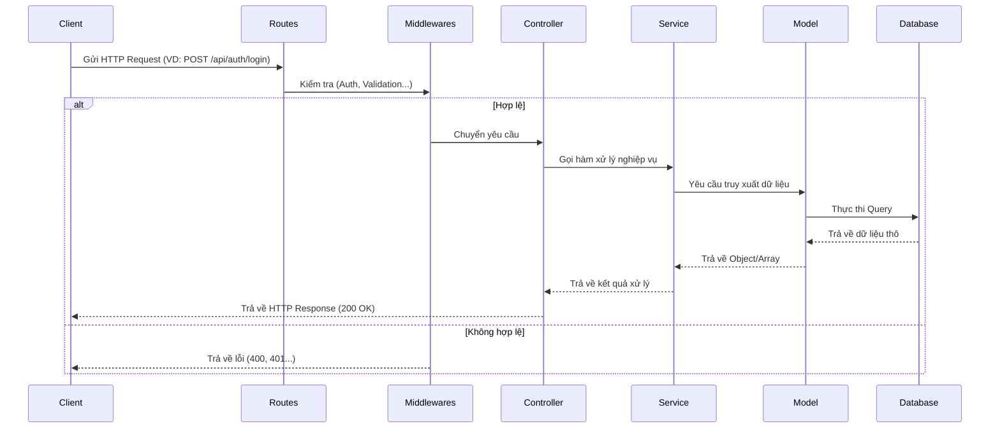

# Kiến trúc Backend - Web BoardGame

Tài liệu này mô tả chi tiết cấu trúc thư mục, kiến trúc phân lớp và quy trình xử lý yêu cầu (request flow) của hệ thống Backend.

## 1. Tổng quan Công nghệ
Hệ thống được xây dựng trên nền tảng:
- **Ngôn ngữ:** Node.js (ES Modules)
- **Framework:** Express.js
- **Database Query Builder:** Knex.js
- **Cơ sở dữ liệu:** PostgreSQL(Supabase)

## 2. Cấu trúc thư mục (`backend/src`)

Kiến trúc được tổ chức theo mô hình **Layered Architecture** (Kiến trúc phân lớp):

```text
backend/src/
├── config/             # Cấu hình hệ thống (Swagger,...)
├── controllers/        # Xử lý logic HTTP request và response
├── middlewares/        # Các hàm trung gian (Auth, Error handling, Validation)
├── models/             # Định nghĩa cấu trúc dữ liệu và tương tác DB (Knex)
├── routes/             # Định nghĩa các endpoint API
├── services/           # Xử lý logic nghiệp vụ (Business Logic)
├── app.js              # Cấu hình Express app và middleware
└── server.js           # Điểm khởi đầu của ứng dụng (Entry point)
```

## 3. Kiến trúc Phân lớp (Layered Architecture)

Hệ thống chia làm 4 lớp chính để đảm bảo tính dễ bảo trì và mở rộng:

1.  **Routes Layer:** Tiếp nhận các HTTP Request và điều hướng đến Controller tương ứng.
2.  **Controllers Layer:** 
    - Nhận dữ liệu từ request (`body`, `params`, `query`).
    - Gọi đến lớp Service để xử lý nghiệp vụ.
    - Trả về HTTP Response cho client.
3.  **Services Layer:** 
    - Nơi tập trung toàn bộ logic nghiệp vụ (Business Logic).
    - Tương tác với lớp Model để đọc/ghi dữ liệu.
    - Không phụ thuộc vào HTTP (có thể tái sử dụng cho các mục đích khác ngoài web).
4.  **Models Layer:** 
    - Tương tác trực tiếp với cơ sở dữ liệu thông qua Knex.js.
    - Thực hiện các truy vấn CRUD.

## 4. Luồng xử lý yêu cầu (Request Flow)

Dưới đây là sơ đồ minh họa cách một yêu cầu được xử lý từ lúc Client gửi đi đến khi nhận kết quả:



## 5. Middleware quan trọng
- `auth.middleware.js`: Kiểm tra JWT Token để định danh người dùng.
- `error.middleware.js`: Tập trung xử lý tất cả các lỗi trong hệ thống và trả về format JSON thống nhất.

## 6. Tài liệu API
Hệ thống sử dụng Swagger để tự động tạo tài liệu. Bạn có thể truy cập tại:
`http://localhost:5000/api-docs` (hoặc cổng tương ứng khi chạy thực tế).
